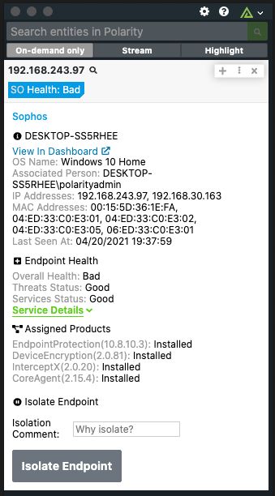
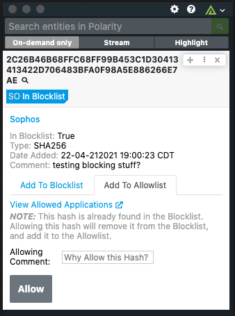

# Polarity Sophos Integration

The Polarity Sophos integration allows Polarity to search Sophos to return found domains, urls, IPs, and SHA256 hashes.  The integration also allows you to Isolated found endpoints, and add SHA256 hashes to your Block and Allow Lists.

  
  

## Sophos Integration Options

### Data Region Url
The Data Region Url for your Tenant ID.

### Tenant ID
The Tenant ID you wish to use in searching.

### Client ID
The Client ID for your Sophos Credentials.  (accessible at https://central.sophos.com/manage/config/settings/credentials)'

### Client Secret
The Client Secret For your Sopho Credentials.

### Allow Block Listing, Allow Listing, and Endpoint Isolation
This allows you to add SHA256 hashes to Allow and Block lists, and Isolate found endpoints.

### Check Isolation Status
If unchecked we will not check to see if an Endpoint is already Isolated unless you attempt to Isolate an Endpoint. 
This reduces the amount of API calls and lessens your chances of hitting your API Limit.

### Check SHA256 Hashes in Block and Allow Lists
If unchecked we will not check to see if a SHA256 hash is already in an Allow/Block list. 
This reduces the amount of API calls and lessens your chances of hitting your API Limit.

### Allow and Block List Cache Time
If a SHA256 hash is submitted to an Allow or Block List outside of this integration, 
this is the amount of time it will take before we register that update in our search. 
The longer this time, the less calls to the API are needed, lessening your chances of hitting your API Limit.
(Unit is in Minutes)

## Installation Instructions

Installation instructions for integrations are provided on the [PolarityIO GitHub Page](https://polarityio.github.io/).

## Polarity

Polarity is a memory-augmentation platform that improves and accelerates analyst decision making.  For more information about the Polarity platform please see:

https://polarity.io/
